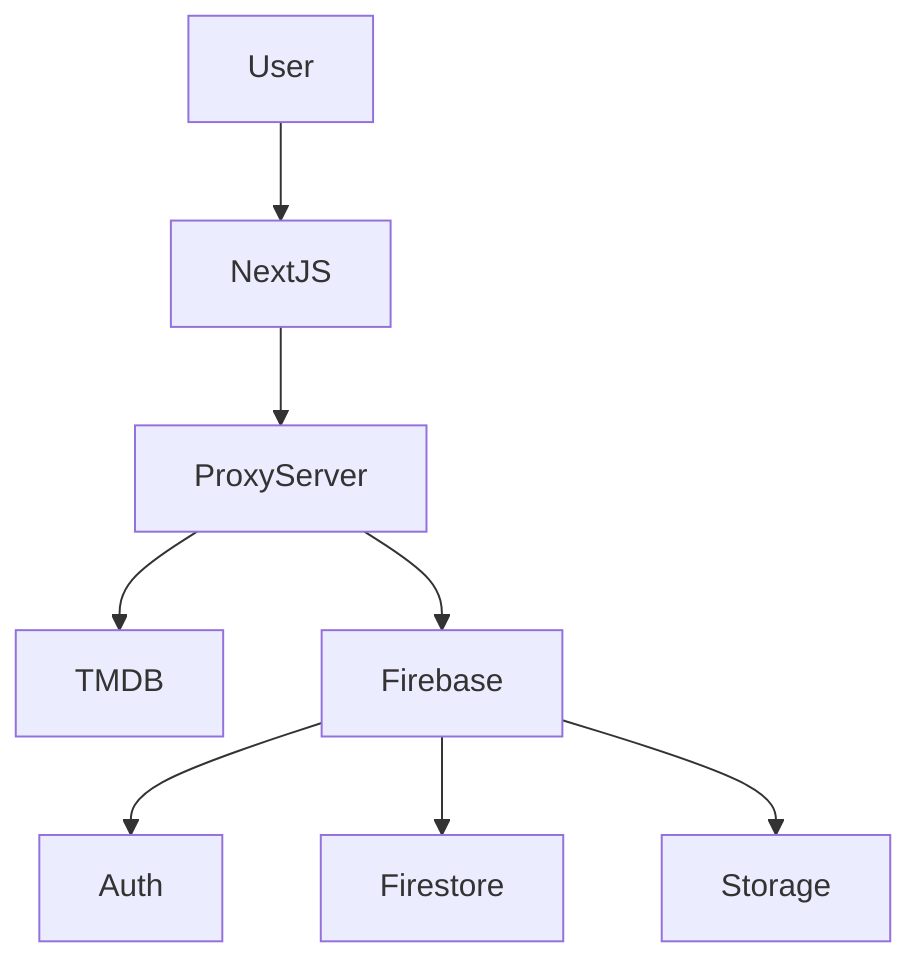
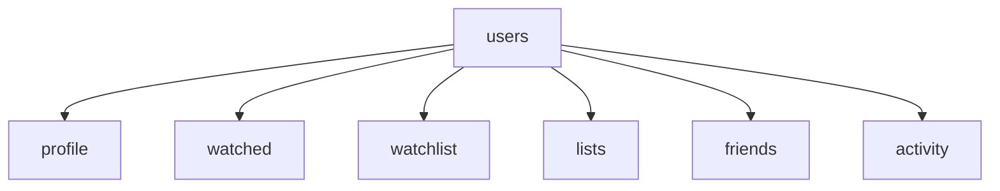

# 🎬 ReelSociety

<div align="center">

### 🌟 Social Movie Discovery Platform

Track 🎥 • Share 🤝 • Discover 🍿 Movies with Friends

<br>


</div>

---

# 🚀 Live Demo

```text
https://reelsociety-web.vercel.app
```

---

# 🎥 Platform Overview

ReelSociety is a **social movie tracking platform** inspired by:

🎬 Letterboxd
⭐ IMDb
📺 Netflix Discovery

Users can:

```
✔ Track Movies
✔ Build Lists
✔ Follow Friends
✔ Share Activity
✔ Discover Trending Movies
```

---

# 🧠 System Architecture



### Architecture Layers

| Layer           | Purpose                                |
| --------------- | -------------------------------------- |
| 🎨 Frontend     | UI built using **Next.js + React**     |
| 🔐 Proxy Server | Protects API keys and handles requests |
| 🔥 Firebase     | Authentication + Firestore Database    |
| 🎬 TMDB API     | Movie data and metadata                |

---

# 🔐 Proxy Server System

To **protect TMDB API keys**, ReelSociety uses **Next.js API routes as a proxy**.

### Example

Frontend request:

```
/api/tmdb/trending
```

Server route:

```
app/api/tmdb/trending/route.ts
```

Request flow:

```
User Browser
     │
     ▼
Next.js Frontend
     │
     ▼
Next.js API Route (Proxy)
     │
     ▼
TMDB API
```

### Benefits

✔ API key protection
✔ Rate-limit control
✔ Server caching capability
✔ Faster responses

---

# 🧩 Core Features

## 🎬 Movie Discovery

```
🔥 Trending Movies
⭐ Top Rated Movies
🎭 Genre Based Movies
```

Powered by **TMDB API**

---

## 👥 Social System

```
Send Friend Requests
Accept / Reject Requests
Remove Friends
View Friend Profiles
```

Firestore structure example:

```
users
 └── userId
      └── friends
           └── friendId
```

---

## 📊 Community Activity Feed

Users generate activity when they:

```
Watch Movie
Rate Movie
Add to Watchlist
Create Lists
```

Example feed:

```
Anurag watched Inception
Paramjeet rated Interstellar ⭐ 9
Harsh added Dune to watchlist
```

---

## 🏆 Leaderboard

Users ranked based on **movies watched**.

Badges:

```
👑 Cinema God
🔥 Binge King
⭐ Top Critic
🎬 Cinephile
🎟 Explorer
```

---

## 📖 Movie Diary

A **personal movie journal** where users track watched movies.

Each entry contains:

```
Movie Poster
Movie Title
Watch Date
Rating
```

---

## 📚 Custom Lists

Users create **movie collections**.

Examples:

```
Best Horror Movies
Christopher Nolan Films
Weekend Watchlist
```

---

# 🗄 Firestore Database Structure



Expanded structure:

```
users
 └── {userId}
      │
      ├── username
      ├── email
      ├── photoURL
      ├── bio
      ├── createdAt
      │
      ├── watched
      │   └── {movieId}
      │       ├── title
      │       ├── poster_path
      │       ├── rating
      │       └── watchedAt
      │
      ├── watchlist
      │   └── {movieId}
      │       ├── title
      │       ├── poster_path
      │       └── addedAt
      │
      ├── lists
      │   └── {listId}
      │       ├── name
      │       ├── description
      │       ├── isPublic
      │       └── movies
      │            └── {movieId}
      │
      ├── friends
      │   └── {friendId}
      │
      └── activity
          └── {activityId}
              ├── type
              ├── movieId
              ├── movieTitle
              ├── rating
              └── createdAt
```

---

# 📂 Project Structure

```
reelsociety-web
│
├── app
│   ├── api
│   │   └── tmdb
│   │
│   ├── dashboard
│   ├── profile
│   ├── friends
│   ├── community
│   ├── watchlist
│   ├── lists
│   └── diary
│
├── components
│   ├── HeroBanner
│   ├── LazyMovieRow
│   ├── ActivityCard
│   ├── FriendsTrending
│   └── DownloadApp
│
├── services
│   └── friendService
│
├── context
│   └── AuthContext
│
├── lib
│   └── firebase
│
└── styles
    └── globals.css
```

---

# 📸 Screenshots

### Dashboard

```
Trending Movies
Top Rated Movies
Friends Trending
```

### Community Feed

```
Activity Feed
Leaderboard
```

### Profile

```
User Avatar
Stats
Lists
Recently Watched
```

---

# 🛠 Tech Stack

### Frontend

```
Next.js 14
React
TailwindCSS
TypeScript
```

### Backend

```
Firebase Authentication
Firestore Database
Firebase Storage
```

### APIs

```
TMDB API
```

### Deployment

```
Vercel
```

---

# ⚙️ Installation

Clone repository

```bash
git clone https://github.com/Anuragchoudhary007/reelsociety-web.git
```

Install dependencies

```bash
npm install
```

Run development server

```bash
npm run dev
```

Open:

```
http://localhost:3000
```

---

# 🔑 Environment Variables

Create `.env.local`

```
NEXT_PUBLIC_FIREBASE_API_KEY=
NEXT_PUBLIC_FIREBASE_AUTH_DOMAIN=
NEXT_PUBLIC_FIREBASE_PROJECT_ID=
NEXT_PUBLIC_FIREBASE_STORAGE_BUCKET=
NEXT_PUBLIC_FIREBASE_MESSAGING_SENDER_ID=
NEXT_PUBLIC_FIREBASE_APP_ID=

TMDB_API_KEY=
```

---

# 👨‍💻 Team

## 👨‍💻 Anurag Choudhary

Founder
Lead Developer · Backend · API Engineer

GitHub
[https://github.com/Anuragchoudhary007](https://github.com/Anuragchoudhary007)

---

## 👨‍💻 Paramjeet Singh

Full Stack Developer
UI/UX Engineer

GitHub
[https://github.com/panwar-cloud](https://github.com/panwar-cloud)

---

## 👨‍💻 Harsh Patidar

Designer
Proxy Engineer

GitHub
[https://github.com/harshpatidar743](https://github.com/harshpatidar743)

---

# 📱 Android App

The Android app connects to the same backend.

```
Track movies
Create lists
Sync activity
```

Download APK from the website.


# 🔮 Future Improvements

```
AI Movie Recommendations
Real-time friend activity
Movie discussion threads
Push notifications
Play Store release
```

---

# ⭐ Support

If you like this project:

```
⭐ Star the repository
```

---

# 📜 License

MIT License

---

